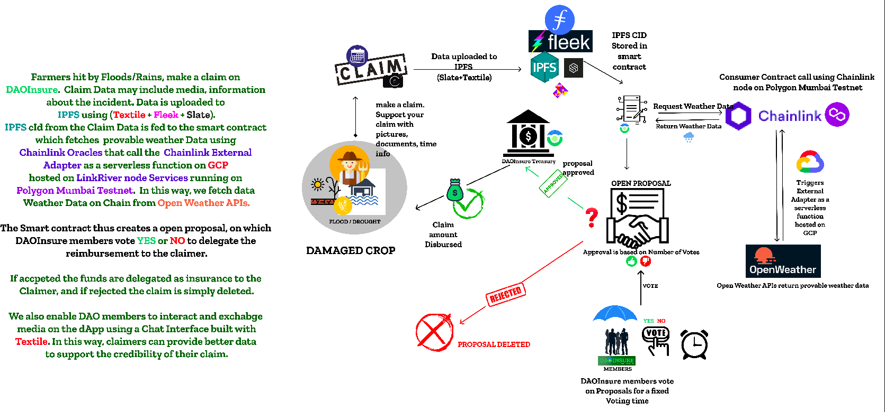

<h1 align="center">DAOInsure</h1>

<h6 align="center">Built at ETHIndia ETHOdyssey 2021 by DevFolio</h6>

 
 
  
<a href="">Watch Demo Video on YouTube</a>

## Bounties we have worked on

<h3 align="center">DAOInsure aims to solve the problem of transparency with respect to conventional Insurance reimbursements.</h3>

    <a href="">View Demo</a>
    ·
    <a href="https://github.com/DAOInsure/DAOInsure/issues">Report Bug</a>
    ·
    <a href="https://github.com/DAOInsure/DAOInsure/issues">Request Feature</a>
  

##  Features

 ✔️ A user needs to start streaming DAIx at 10DAIx/month rate as Insurance Premium to the DAOInsure Treasury to become a member. Members receive streams of $INSURE tokens at the same rate. We provide seamless connection using Metamask and  and a flexible experience with Portis. 

 ✔️  StakeDAO provides effortless ways to earn yield on the Premium Deposit.

 ✔️  Farmers hit by Floods/Rains, make a claim on DAOInsure.  Claim Data may include media, information about the incident. Data is uploaded to IPFS using (Textile + Fleek + Slate). IPFS cId from the Claim Data is fed to the smart contract which fetches  provable weather Data using Chainlink Oracles that call the  Chainlink External Adapter as a serverless function on GCP hosted on LinkRiver node Services running on Polygon Mumbai Testnet.  In this way, we fetch data 
Weather Data on Chain from Open Weather APIs. 

 ✔️ The Smart contract thus creates a open proposal, on which DAOInsure members vote YES or NO to delegate the reimbursement to the claimer. 

 ✔️ If accpeted the funds are delegated as insurance to the Claimer, and if rejected the claim is simply deleted. Members can view Open and Closed Claims on DAOInsure 

 ✔️  We also enable DAO members to interact and exchabge media on the dApp using a Chat Interface built with Textile. In this way, claimers can provide better data to support the credibility of their claim.

 ✔️ We also Index Data on Chain with The Graph + Superfluid Subgraph on Polygon. Check real time analysis on our Dashboard powered by Nivo and The Graph and view insight on Outflows and the associated addresses of the DAOInsure Members. 

 
 **A lot more to come!**

## Architecture

### How do users become members on DAOInsure DAO ?

### How does it all work ?

### Built With
We have used the following technologies for this project:
* [Solidity](https://docs.soliditylang.org/en/v0.8.3/) (Language for writing smart contracts of the Dapp)
* [Chainlink](https://chain.link/) (For getting provable weather data on Chain using Chainlink External Adapters)
* [Filecoin](https://filecoin.io/) (Infura IPFS Node, along with Textile and Slate for uploading files to the IPFS, decentralised chat, all built on Filecoin)
* [Infura](https://infura.io/) (APIs to Connect to the blockchain and free IPFS node)
* [IPFS](https://ipfs.io/) (IPFS storing media related to DAOInsure Claims and Chats among the members of the DAO)
* [Superfluid](https://www.superfluid.finance/) (Superfluid is used to stream Premium to the DAO Treasury, in return of DAO Tokens streamed back to the DAO Members.)
* [Polygon](https://polygon.technology) (Polygon is a Layer-2 scaling solution built on top of Ethereum to solve for low throughput and high transaction costs. We have deployed our smart contracts to the Polygon Mumbai testnet to leverage the low transaction costs and low block time.)
* [Metamask](https://metamask.io) (Wallet Provider)
* [Portis](https://portis.io) (Wallet Provider)
* [The Graph](https://thegraph.com/) (Index the sum of streams using Superfluid Subgraph on Polygon Mumbai Testnet and render the statistics on a React-Nivo PieChart in the Dashboard.)
* [Slate](https://slate.host)(Slate is a new file-sharing network built on Filecoin that makes it possible for people to collect, organize, and link files together.)
* [StakeDAO](https://stakedao.org/)(Stake DAO is a non-custodial platform where you can do more with your money. Easily grow, track, and control your assets right from your wallet. We use StakeDAO to earn yield on Deposit using StakeDAO strategies)
* [Chakra-UI](https://chakra-ui.com) (CSS framework)
* [ReactJS](https://reactjs.org/) (web UI)
* [Nivo](https://nivo.rocks/) (nivo provides a rich set of dataviz components, built on top of the awesome d3 and Reactjs libraries.)
* [GCP](https://cloud.google.com/gcp)(We used a serverless function of our external adapter on GCP)

## Getting Started

### Clone the repo:

`git clone https://github.com/DAOInsure/DAOInsure.git && cd DAOInsure`

### Run the Project

Once you are in the project directory nstall the required dependencies using a package manager `yarn` or `npm`.

`yarn add` or `npm install`

`yarn start` or `npm start`

Runs the app in the development mode.
Open [http://localhost:3000](http://localhost:3000) to view it in the browser.
